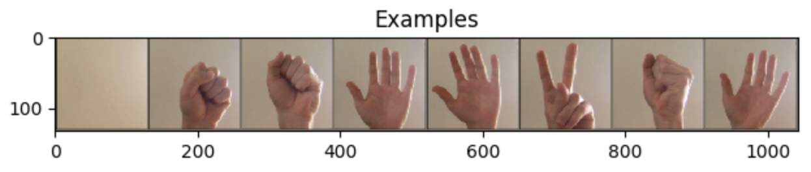
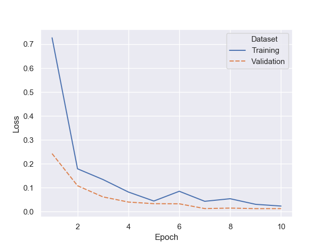
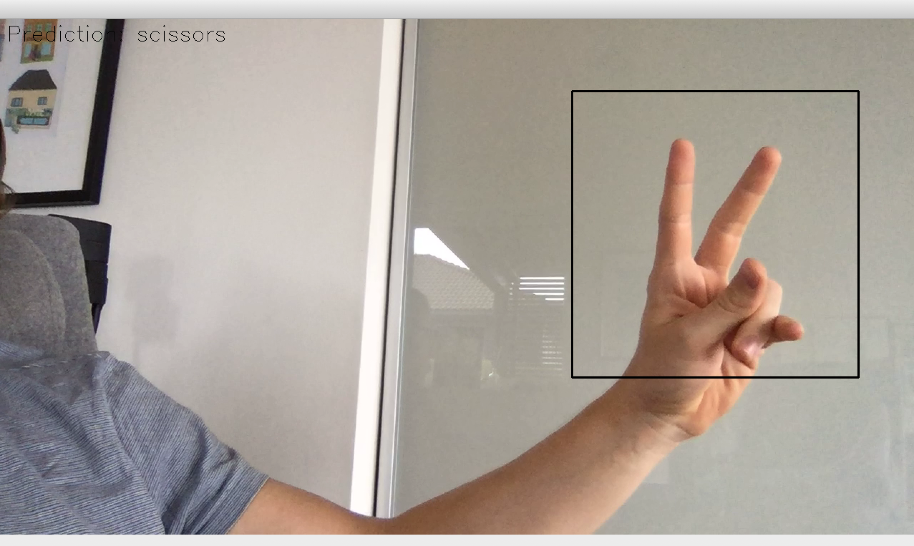

# Rock, paper, scissors with Convolutional Neural Networks 

As a fun project I wanted to see if I could successfully build a dataset of rock, paper, scissors hand movements 
directly from my webcamera, and train a model that could make real time predictions of them. 

## Build dataset
Running *capture_training_data()* from *camera.py* will open up a view that captures images directly from the webcam. 
The view is modified so you can select what kind of data you would collect by pressing keys on the keyboard. (R)ock,
(P)aper, (S)cissors and (N)one. To take a picture just press/hold the Space button, and it will save an image
captured from inside the black square in the view. The image is then saved to its own folder depending on which image 
class is selected. To exit just press Escape. 
  

Here are some examples of images that I collected during my own experiments:
  

## Model
To build the model I just did transfer learning from [ResNet18](https://arxiv.org/abs/1512.03385), and replaced the last
 fully connected layer with a layer that fit for this classification task. 
 
## Training
After collecting enough of all the different hand movements, you can train the model with *train_model(_)* from 
*optimize.py*. I used Cross Entropy Loss and the Adam optimizer to fit this model. The model is saved as a .pth file 
after training. 
  

## Real-time predictions
To do the real-time predictions I made a new camera view, *predict_live(_)*, that makes predictions on every frame of 
the video being captured. With a minimal effort on building the dataset, I manage to get pretty good results with 
this model. 
  
